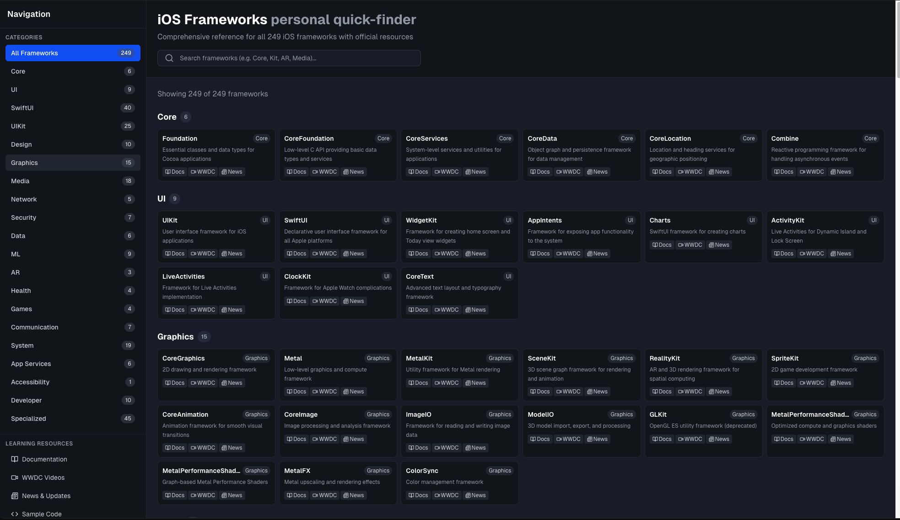

# iOS Frameworks Personal Quick-Finder

A comprehensive reference tool for iOS developers to quickly find and access documentation for all 249 iOS frameworks and components.

## Overview

The iOS Frameworks Personal Quick-Finder is a web-based reference application designed to help iOS developers quickly discover, explore, and access official documentation for Apple's extensive collection of frameworks. Whether you're working with Core frameworks, UI components, SwiftUI elements, or specialized APIs, this tool provides instant access to the resources you need.

## Features

### 🔍 **Comprehensive Framework Database**
- **249 iOS Frameworks** organized by category
- **40 SwiftUI Components** with detailed descriptions
- **25 UIKit Components** for traditional iOS development
- **Core, Graphics, Media, Network, Security** and more categories

### 🎯 **Quick Navigation**
- **Sidebar Navigation** with framework counts for each category
- **Search Functionality** to quickly find specific frameworks
- **Category Filtering** to browse frameworks by type
- **Real-time Results** showing filtered framework counts

### 📚 **Official Resources**
Each framework includes direct links to:
- **📖 Official Documentation** - Apple Developer documentation
- **🎥 WWDC Videos** - Related conference sessions and tutorials
- **📰 News & Updates** - Latest announcements and changes

### 🎓 **Learning Resources**
Dedicated section with links to:
- **Documentation Hub** - Comprehensive guides
- **WWDC Video Library** - Conference sessions
- **News & Updates** - Latest iOS development news
- **Sample Code** - Official code examples

## Categories

- **Core** (6) - Foundation, CoreData, CoreLocation, etc.
- **UI** (9) - UIKit components and interface elements
- **SwiftUI** (40) - Modern declarative UI framework components
- **Graphics** (15) - CoreGraphics, Metal, SceneKit, etc.
- **Media** (18) - AVFoundation, CoreAudio, ImageIO, etc.
- **Network** (5) - Network communication frameworks
- **Security** (7) - Cryptography and security frameworks
- **Data** (6) - Data management and persistence
- **Developer** (10) - Development tools and debugging
- **Specialized** (45) - Domain-specific frameworks

## Technology Stack

- **Next.js 14** - React framework with App Router
- **TypeScript** - Type-safe development
- **Tailwind CSS** - Utility-first styling
- **Responsive Design** - Works on desktop and mobile devices

## Getting Started

1. **Clone the repository**
   \`\`\`bash
   git clone <repository-url>
   cd ios-frameworks-finder
   \`\`\`

2. **Install dependencies**
   \`\`\`bash
   npm install
   \`\`\`

3. **Run the development server**
   \`\`\`bash
   npm run dev
   \`\`\`

4. **Open your browser**
   Navigate to `http://localhost:3000`

## Usage

1. **Browse by Category** - Use the sidebar to explore frameworks by category
2. **Search Frameworks** - Use the search bar to find specific frameworks
3. **Access Resources** - Click on Docs, WWDC, or News buttons for each framework
4. **Learn More** - Visit the Learning Resources section for comprehensive guides

## Perfect For

- **iOS Developers** looking for quick framework reference
- **Students** learning iOS development
- **Teams** needing a centralized framework reference
- **Anyone** exploring Apple's development ecosystem

## Contributing

This is a personal reference tool, but suggestions and improvements are welcome. Feel free to open issues or submit pull requests.

## License

This project is for educational and reference purposes. All framework information and links point to official Apple resources.

---

**Built for iOS developers, by iOS developers** 🍎📱
